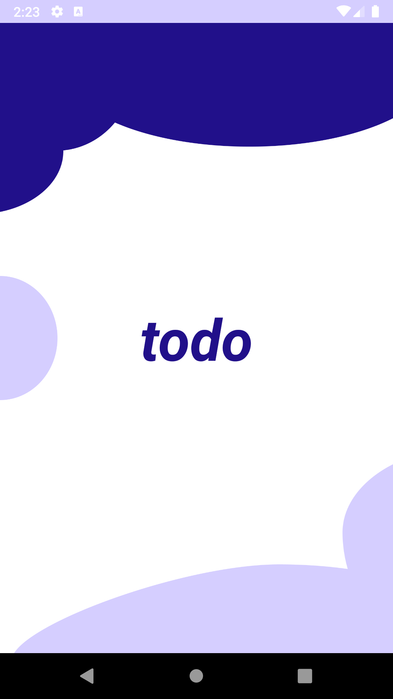
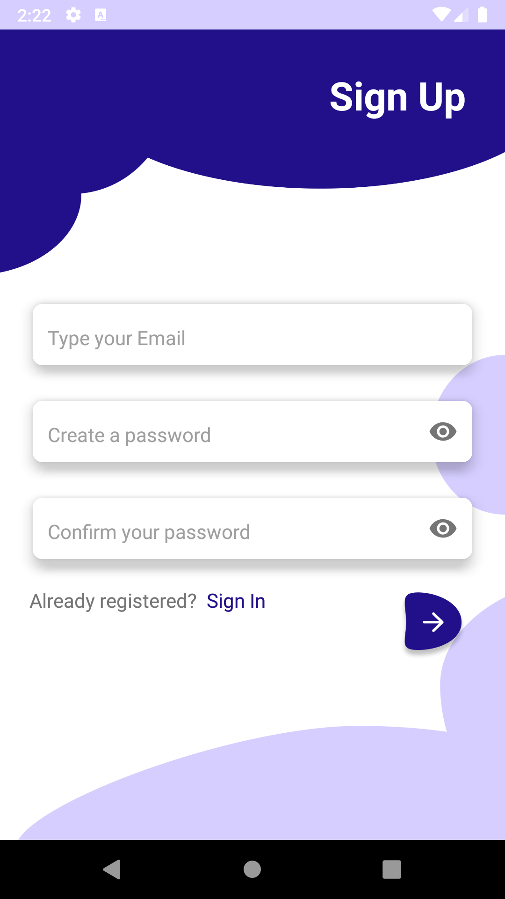
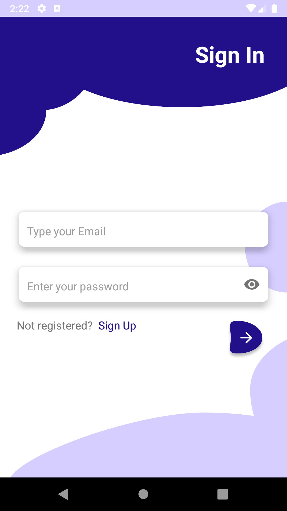
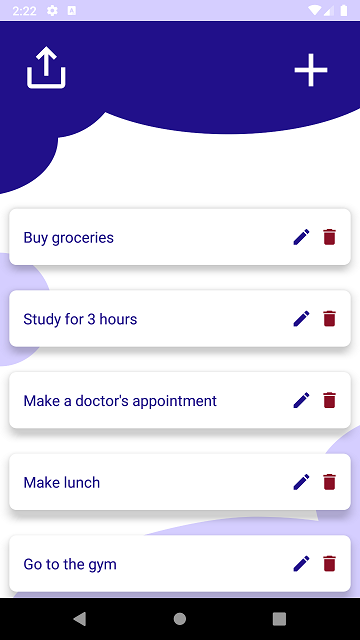
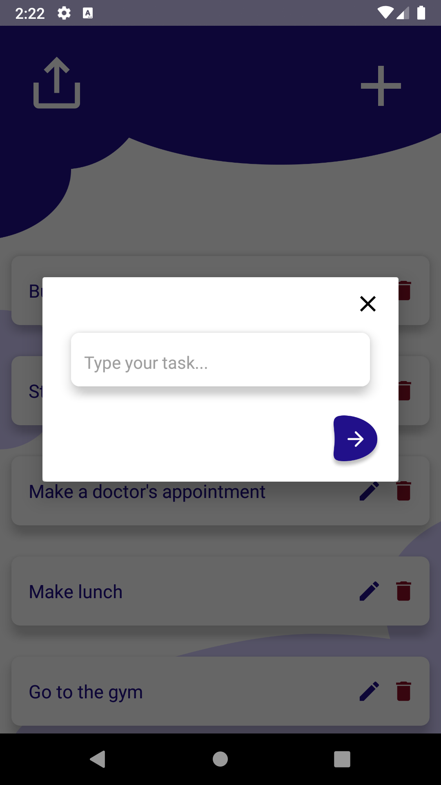

# ToDo App

This app is for writing down tasks. The tasks can be edited or deleted.

The data storage and the user sign-up and sign-in functionality is implemented with Firebase.

The tasks are displayed with RecyclerView and the screens are fragments and the navigation is done through NavGraph.

There is also a splash screen at the launch of the app.

## Screenshots

 
 

